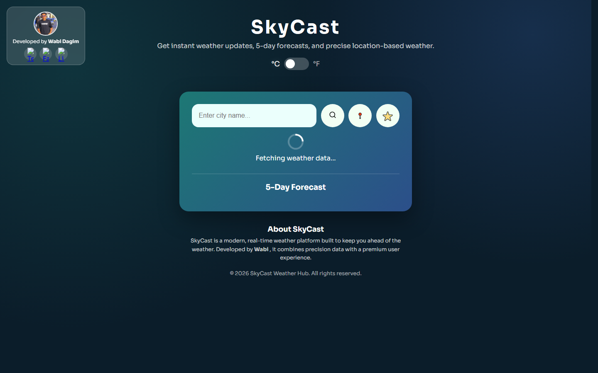
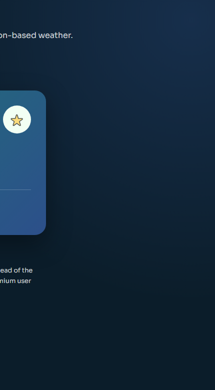
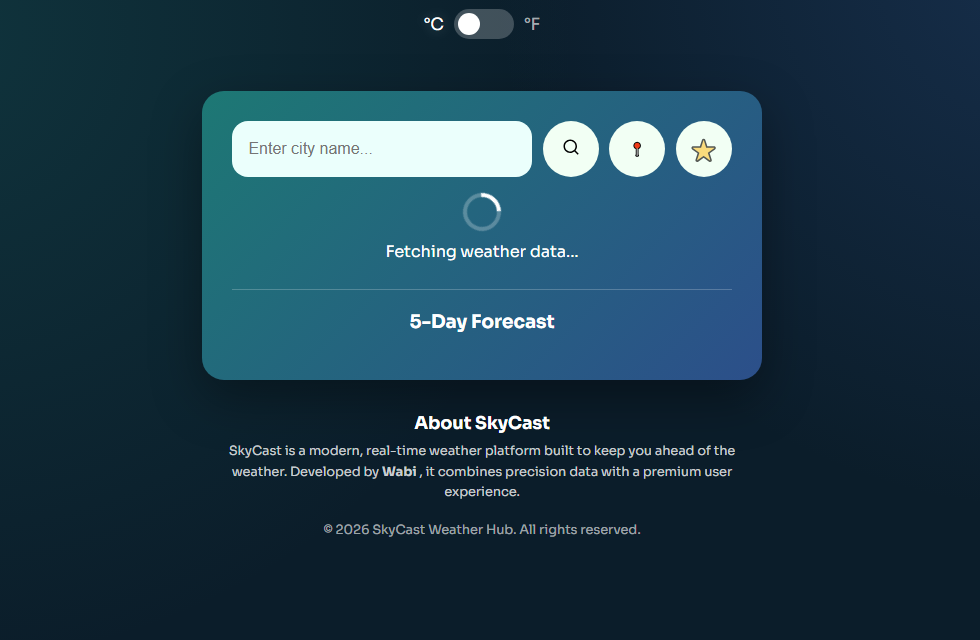

# SkyCast Weather App

A polished weather web app built for real-world use and portfolio presentation.

**Live Demo:** https://weather-app-wabi.vercel.app/

## What problem this solves

People often need fast, reliable weather checks before commuting, traveling, or planning outdoor activities, but many weather tools feel cluttered or slow on mobile.

SkyCast solves this by providing:
- Immediate weather lookup for any city
- 5-day forecast at a glance
- Geolocation-based weather in one click
- A clean, responsive interface that works smoothly on desktop and mobile
- Installable PWA behavior for app-like access

## My role / contributions

I designed and implemented this project end-to-end:
- Product and UI design (layout, responsive experience, weather-themed visuals)
- Frontend engineering in vanilla HTML/CSS/JavaScript
- API integration with OpenWeatherMap and AQI endpoint
- Geolocation search, favorites, autocomplete, and sharing features
- PWA support using manifest + service worker
- SEO basics (meta tags, sitemap, robots)
- Deployment-ready setup for Vercel

## Screenshots

### Desktop Home View


### Mobile-Oriented Panel View


### Forecast Focus View


## Key features

- Real-time weather data by city name
- 5-day forecast cards
- Unit toggle (C/F)
- Air Quality Index display
- Geolocation weather lookup
- Favorite cities saved in local storage
- Search autocomplete suggestions
- Native share API + clipboard fallback
- Install prompt and offline caching support

## Tech stack

- HTML5
- CSS3
- Vanilla JavaScript (ES6+)
- OpenWeatherMap API
- OpenStreetMap Nominatim API
- Service Worker + Web App Manifest

## Run locally

1. Clone the repository
2. Open the project folder
3. Start a local static server (example):

```bash
python -m http.server 5500
```

4. Open `http://localhost:5500`

## Notes for API setup

The app reads weather API key from `window.__OWM_API_KEY__` when available, with a built-in fallback currently present in `main.js`.
For production freelancing work, use a restricted key and domain limits in OpenWeatherMap.

## Folder structure

```text
Weather-app/
  assets/
    screenshots/
  index.html
  styles.css
  main.js
  manifest.json
  sw.js
  robots.txt
  sitemap.xml
  vercel.json
```

## Why this is portfolio-ready

- Clear product positioning and business value
- Strong visual presentation for client trust
- Production-oriented considerations (PWA, SEO, deployment)
- Readable, modular front-end logic that is easy to extend

## Contact

If you want a custom weather dashboard, travel planner integration, or branded version for your business, reach out through my portfolio/social links in the app.
